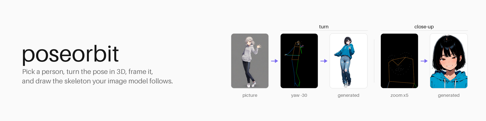
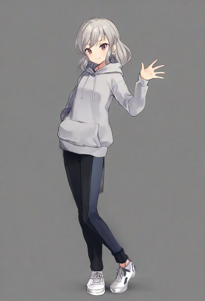
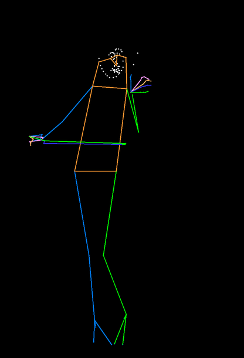
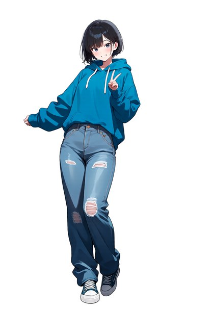
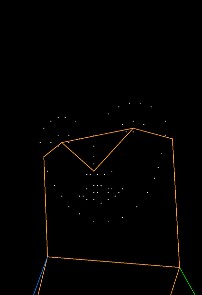
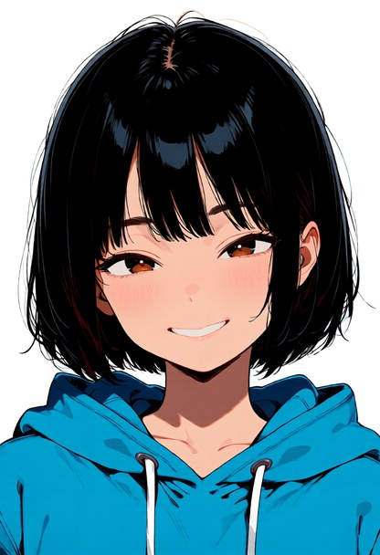
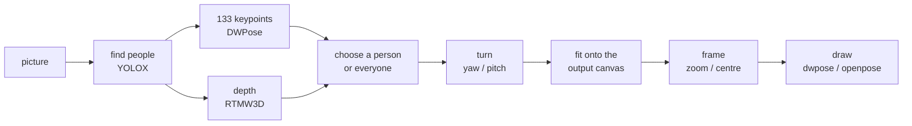

<picture>
  <source media="(prefers-color-scheme: dark)" srcset="docs/assets/banner-dark.png">
  
</picture>

# poseorbit

[](LICENSE)


[](https://github.com/33rd-kk/poseorbit/actions/workflows/test.yml)

**Take the pose from a picture, pick whose, look at it from another angle or
closer in, and get the skeleton your image model follows.**

poseorbit finds every person in a picture, lets you choose one (or everyone),
turns the whole-body pose (hands and face included) in 3D, frames it (from a
face close-up to room around the figure), and draws the skeleton in the style
a pose-conditioned model was trained on. It is a small Python package: CPU
only, no torch, usable as a library, a command, or an HTTP server.

```python
from PIL import Image
from poseorbit import Camera, Detector, Framing, pose

result = pose(Detector(), Image.open("group.png"), size=(832, 1216),
              person=1, camera=Camera(yaw=40, pitch=10),
              framing=Framing(zoom=2, x=0.5, y=0.35), style="openpose")
result.skeleton.save("skeleton.png")   # feed this to your ControlNet or pose adapter
```

## Examples

One reference, two skeletons, two pictures generated from them:

| Reference | Turned: `Camera(yaw=-30)` | Generated | Close-up: `Framing(zoom=5)` on the face | Generated |
|---|---|---|---|---|
|  |  |  |  |  |

All pictures were generated for this README. The reference: Illustrious XL
2.0, "1girl, solo, full body, standing, waving, one hand raised, head tilt,
grey hoodie, black pants, white sneakers, simple background", seed 13. The
other two: Anima Base 1.0 with Anima-Control-Pose (`dwpose` style), 832×1216,
30 steps, CFG 5, "1girl, solo, short black hair, blue oversized hoodie, loose
jeans, sneakers, front view, looking at viewer, smile, simple background"
plus "full body" or "portrait, face focus, close-up", seed 43 each (picked
from four and three). The skeleton sets the figure, the prompt everything
else. Note that Anima and Anima-Control-Pose are under CircleStone Labs'
non-commercial licence (pictures made with them are not restricted);
poseorbit itself does not use or include them.

## How it works



One person detector feeds two keypoint models on the same boxes: DWPose gives
x and y, RTMW3D (only when a turn is asked for) gives depth. The camera is
orthographic and orbits the middle of the drawn people's hips. The turned
pose is letterboxed onto the output's canvas, framed like a cropped photo,
and drawn on black.

## What sets it apart

Turning a pose in 3D for ControlNet is not new (see
[related projects](#related-projects)). poseorbit's choices are different:

- **Depth for all 133 whole-body points, from one picture.** x and y come
  from DWPose (RTMW-DW-x-l) and depth from RTMW3D-x, run on the *same*
  person boxes. Hands and face turn with the body instead of staying flat or
  being dropped, and the front view is pixel-identical to plain 2D detection.
- **Choose a person in a group.** Everyone found comes back left to right
  with a box, so index 1 is the same person on every call. Draw one of them
  or all of them, turned together around a shared centre so the group keeps
  its layout.
- **Drawn for the model that will read it.** `dwpose` is rtmlib's
  COCO-WholeBody drawing (thin lines, hands and face), the usual input of
  DWPose-trained adapters. `openpose` is the thick, body-only drawing
  xinsir's OpenPose ControlNet for SDXL was trained on, line width growing
  with the canvas as its model card specifies.
- **Framing, not just turning.** Zoom from ×0.5 to ×6 around any point of
  the output canvas: a face or upper-body close-up from a full-body
  reference, or a smaller figure with room around it. The answer says how
  many body joints are left in the frame, so a client can warn when a
  body-only skeleton has little to follow.
- **What you preview is what is followed.** The whole mapping (turn,
  letterbox, framing) is specified [below](#coordinates), so a browser
  viewer can show exactly what will be drawn. Latentry's three.js view is
  tested against it to within 0.05 px.
- **No framework attached.** No ComfyUI or web UI required, no torch, no
  GPU: a library, `python -m poseorbit draw`, or `python -m poseorbit serve`
  answering `POST /api/pose`. A generation server can embed the same handler
  (`poseorbit.api.handle`) so both speak one API.
- **Guard rails from measurement.** Turning is held to ±90° yaw and ±45°
  pitch, where single-picture depth is still mostly right. Detections with
  fewer than 8 of 17 body joints seen are not offered as people (a blank
  canvas otherwise "finds" one).

## Measured

Generated with and without the skeleton, same seed, 832×1216. The score is
PCK@0.1 of the re-detected output against the skeleton: 1.0 means every
point landed within 10% of the diagonal of where the skeleton put it.

| Model | Pose | Without | With |
|---|---|---|---|
| Illustrious XL 2.0 + xinsir OpenPose ControlNet (`openpose`) | walking, front | 0.76 | **0.94** |
| same | standing, front | 0.47 | **0.76** |
| same | walking, turned yaw 45° / yaw −60° pitch 15° | — | **0.94 / 0.88** |
| Anima Base 1.0 + Anima-Control-Pose (`dwpose`) | walking, front | 0.06 | **0.71** |
| same | walking, turned yaw 45° | — | **0.94** |

Framed, scored on the body and face points left in the frame (the prompt
says "upper body" or "portrait, close-up" in both runs):

| Model | Framing | Without | With |
|---|---|---|---|
| Illustrious XL 2.0 + xinsir ControlNet | upper body, ×2 | 0.02 | **1.00** |
| same | face, ×5 (7 body joints left) | 0.48 | **0.99** |
| Anima Base 1.0 + Anima-Control-Pose | upper body ×2 / face ×5 | 0.93 / 0.97 | 0.93 / 0.99 |

Anima already centres a close-up by itself, so its score barely moves; with
the skeleton the head's tilt and turn follow the reference. Detection takes
about 0.7 s for one person on a desktop CPU, all three models together.

## Install

Python 3.10 or newer.

```sh
pip install "poseorbit @ git+https://github.com/33rd-kk/poseorbit"
pip install "poseorbit[server] @ git+https://github.com/33rd-kk/poseorbit"   # with the HTTP server
```

The model files (about 700 MB, all Apache-2.0) download from Hugging Face on
first use into `~/.cache/poseorbit`, or the `weights_dir` you give `Detector`.

## Use

### From Python

```python
from pathlib import Path
from PIL import Image
from poseorbit import ALL_PEOPLE, Camera, Detector, Framing, pose

detector = Detector(weights_dir=Path("weights"))   # load once, reuse; thread-safe
picture = Image.open("reference.png")

people = detector.detect(picture)                  # everyone, left to right
print([p.bbox for p in people])                    # boxes in the picture's pixels

result = pose(detector, picture, size=(832, 1216), person=ALL_PEOPLE,
              camera=Camera(yaw=-30), style="dwpose")
result.skeleton            # PIL image, 832x1216, on black
result.joints_in_frame     # body joints left inside the canvas
```

### With diffusers

```python
import torch
from diffusers import ControlNetModel, StableDiffusionXLControlNetPipeline

controlnet = ControlNetModel.from_pretrained("xinsir/controlnet-openpose-sdxl-1.0", torch_dtype=torch.float16)
pipe = StableDiffusionXLControlNetPipeline.from_pretrained(
    "stabilityai/stable-diffusion-xl-base-1.0", controlnet=controlnet, torch_dtype=torch.float16
).to("cuda")

skeleton = pose(detector, picture, size=(832, 1216), camera=Camera(yaw=45), style="openpose").skeleton
image = pipe("1girl, full body", image=skeleton, width=832, height=1216).images[0]
```

### From the command line

```sh
python -m poseorbit draw ref.png skeleton.png --size 832x1216 --person -1 --yaw 40 --style openpose
python -m poseorbit draw ref.png face.png --size 832x1216 --zoom 5 --centre 0.62,0.2
```

### Over HTTP

```sh
python -m poseorbit serve --port 7870      # set POSEORBIT_TOKEN to require a Bearer token
```

```sh
curl -s localhost:7870/api/pose -H 'Content-Type: application/json' -d '{
  "image_base64": "<base64 PNG or JPEG>", "width": 832, "height": 1216,
  "person": 0, "want_3d": true,
  "camera": { "yaw": 30, "pitch": 10, "framing": { "zoom": 2, "x": 0.5, "y": 0.35 } },
  "style": "openpose" }'
```

```json
{ "skeleton_base64": "…png…", "width": 832, "height": 1216, "person": 0,
  "camera": { "yaw": 30, "pitch": 10, "framing": { "zoom": 2, "x": 0.5, "y": 0.35 } },
  "style": "openpose", "limits": { "yaw": 90, "pitch": 45, "zoom": [0.5, 6] },
  "joints_in_frame": 13,
  "people": [ { "bbox": [0.31, 0.2, 0.8, 1.0],
                "points_3d": [[0.61, 0.24, -0.03], "…"], "scores": [0.92, "…"] } ] }
```

Everything but `image_base64` is optional. `person` is an index into
`people` (left to right), `-1` for everyone, or absent for the most
confident. `want_3d` adds each person's 133 points as `[x, y, z]` in units of
the picture's width, for a 3D viewer. Out-of-range angles and zoom are
clamped; a picture with nobody in it, or a person index past the end, gets a
400 with a `detail` message. Server and API are 127.0.0.1-only by default.

## Reference

| Name | What it is |
|---|---|
| `Detector(weights_dir=None, device="cpu")` | Loads the models on first use. `detect(image, depth=False) -> list[Person]`, left to right; raises `NoPersonError`. |
| `pose(detector, image, size, person=None, camera=None, style="dwpose", depth=False, framing=None) -> PoseResult` | Detect, choose, turn, frame and draw in one call. |
| `Camera(yaw=0, pitch=0)` | Degrees. `+yaw` swings the camera to the viewer's right, `+pitch` raises it. Clamped to `MAX_YAW` (90) / `MAX_PITCH` (45). |
| `Framing(zoom=1, x=0.5, y=0.5)` | The canvas point `(x, y)` (fractions) goes to the middle, scaled by `zoom` (`MIN_ZOOM` 0.5 to `MAX_ZOOM` 6). |
| `PoseResult` | `skeleton` (PIL image), `people`, `person`, `camera` and `framing` as used, `joints_in_frame`. |
| `Person` | `keypoints` (133×2), `scores` (133), `depth` (133 or None), `bbox`, `visible` (body joints seen), `points_3d`. |
| `render(keypoints, scores, size, style)` | Draw `(N, 133, 2)` keypoints on a black `size` canvas. |
| `letterbox(skeleton, size)` | Fit a skeleton drawn at another size onto `size`, uniformly scaled and centred. |
| `poseorbit.api.handle(detector, body, default_style)` | The `/api/pose` handler without a web framework, to embed in another server. |

### Skeleton styles

| Style | Drawing | For |
|---|---|---|
| `dwpose` | rtmlib's COCO-WholeBody: thin coloured lines, body, feet, hands and face | DWPose-trained adapters, such as Anima-Control-Pose |
| `openpose` | 18 OpenPose body points, thick translucent limbs scaled with the canvas | OpenPose ControlNets, such as xinsir/controlnet-openpose-sdxl-1.0 |

## Coordinates

x right, y down, depth away from the viewer, all in the picture's pixels
(the API scales them by the picture's width). The camera at (`yaw`, `pitch`)
stands at `(sin yaw · cos pitch, −sin pitch, −cos yaw · cos pitch)` from the
centre (the middle of the drawn people's hips). In a y-up, z-toward-viewer
frame such as three.js that is `(sin yaw · cos pitch, sin pitch, cos yaw ·
cos pitch)`.

The turned picture is letterboxed onto the output canvas, then framed:
canvas point `(x, y)` (fractions) goes to the middle and everything scales
by `zoom` around it. Framing never moves the point the camera orbits.

## Limits

- Depth is estimated from a single picture: past a side view, which limb is
  in front gets unreliable. That is why the camera is limited.
- Chosen from a group, a person is drawn where they stand in the picture,
  letterboxed onto the output. A small figure gives a small skeleton, which
  models follow loosely; zoom in on them.
- Some models do not tell front from back by the skeleton alone. Anima, for
  one, often draws a strongly turned figure from behind. What helps: turn
  away from the side the figure already shows (look at `Person.depth`: the
  nearer shoulder is the smaller value), keep the turn moderate, and put
  "front view" in the prompt and "from behind" in the negative.
- Animals and non-human figures are not detected.

## Related projects

Other ways to get a turned or posed skeleton, each with its own strengths:

- [3D Openpose Editor](https://github.com/ZhUyU1997/open-pose-editor): a
  browser 3D mannequin editor for Stable Diffusion web UI, with hand editing
  and depth, normal and canny maps.
- [ComfyUI-Magos-Nodes](https://github.com/MagosDigitalStudio/ComfyUI-Magos-Nodes):
  a DWPose skeleton editor for ComfyUI with NLF-based 3D, an orbit view and
  animated cameras for video.
- [ComfyUI-Fisher-Pose](https://github.com/Work-Fisher/ComfyUI-Fisher-Pose):
  a posable MakeHuman mannequin and camera moves for Qwen-Image editing.
- [RTMW / RTMW3D](https://arxiv.org/abs/2407.08634) and
  [rtmlib](https://github.com/Tau-J/rtmlib): the models and the runtime
  poseorbit is built on.

## Used by

Latentry, a local web UI for diffusion backends, uses poseorbit for its pose
slot and its 3D pose view.

## Development

```sh
pip install -e ".[test,server]"
pytest                             # geometry and API checks; no model download
python scripts/make_banner.py      # redraws docs/assets/banner-*.png
```

## Security

Report vulnerabilities privately through
[GitHub's reporting](https://github.com/33rd-kk/poseorbit/security/advisories/new);
see [SECURITY.md](SECURITY.md).

## License

Apache-2.0. See [LICENSE](LICENSE), and [NOTICE](NOTICE) for the third-party
work poseorbit builds on (rtmlib; the OpenPose drawing from xinsir's model
card and controlnet_aux). The model files (OpenMMLab's YOLOX, RTMW and
RTMW3D, Apache-2.0) are downloaded, not shipped. Models you condition with
the skeletons keep their own licences. The example pictures in
`docs/assets` were generated by the author for this README.
