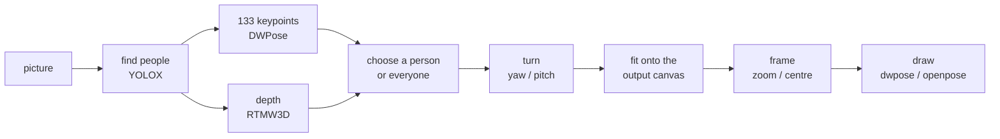

# poseorbit

<picture>
  <source media="(prefers-color-scheme: dark)" srcset="assets/banner-dark.png">
  
</picture>

**Take the pose from a picture, pick whose, look at it from another angle or
closer in, and get the skeleton your image model follows.**

poseorbit finds every person in a picture, lets you choose one (or everyone),
turns the whole-body pose (hands and face included) in 3D, frames it, and
draws the skeleton in the style a pose-conditioned model was trained on. CPU
only, no torch: a library, a command, or an HTTP server.

## Install

```sh
pip install poseorbit
pip install "poseorbit[server]"     # with the HTTP server
```

Python 3.10 or newer. The model files (about 700 MB, Apache-2.0) download
from Hugging Face on first use into `~/.cache/poseorbit`.

## In five lines

```python
from PIL import Image
from poseorbit import Camera, Detector, Framing, pose

result = pose(Detector(), Image.open("group.png"), size=(832, 1216),
              person=1, camera=Camera(yaw=40, pitch=10),
              framing=Framing(zoom=2, x=0.5, y=0.35), style="openpose")
result.skeleton.save("skeleton.png")   # feed this to your ControlNet or pose adapter
```

## How it works



One person detector feeds two keypoint models on the same boxes: DWPose
gives x and y, RTMW3D (only when a turn is asked for) gives depth. The camera
is orthographic and orbits the middle of the drawn people's hips. The turned
pose is letterboxed onto the output's canvas, framed like a cropped photo,
and drawn on black.

## Where next

- [Usage](guide/usage.md): each step with code, and using the skeleton with diffusers.
- [Skeleton styles](guide/styles.md): which drawing for which model.
- [Coordinates](guide/coordinates.md): the exact mapping, for a viewer that must match.
- Reference: the [Python API](reference/python.md), the [HTTP API](reference/http.md) and the [command line](reference/cli.md).
